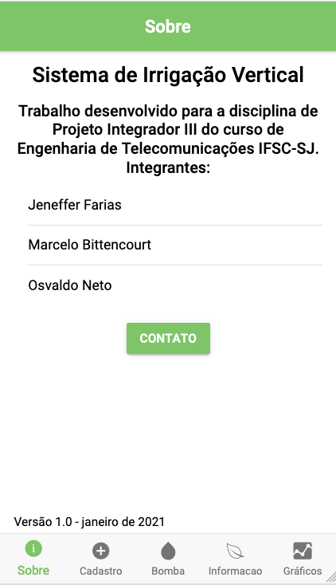
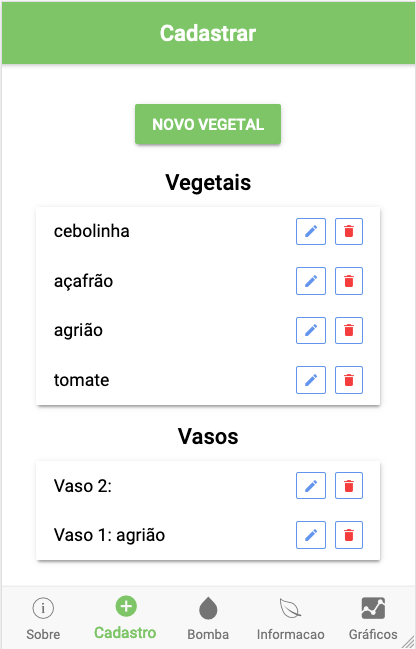
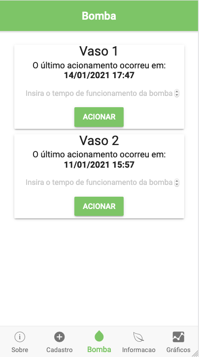
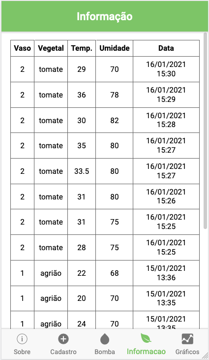
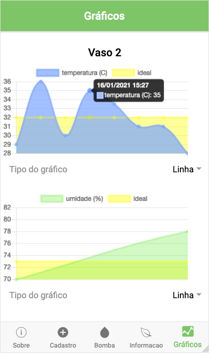

## Sistema de Irrigação Vertical (SIV)
> Aplicativo desenvolvido em IONIC 3 Angular

 

### Abaixo estão demonstradas as principais páginas e ações que o usuário pode realizar no aplicativo.

## 1) Sobre 

Principais informações do projeto, onde o usuário poderá entrar em contato via e-mail com os integrantes.

      
  

  
## 2) Cadastro

O usuário pode cadatrar um novo vegetal acionando o botão **Novo Vegetal**, que será redirecionado para uma nova página onde deverá informar o nome, a temperatura ideal o a umidade ideal do mesmo. Também será possível alterar as informações de um vegetal já existente acionando o ícone de edição ao lado do vegetal.

Em relação ao vaso, será permitido inativá-lo através do ícone vermelho ao lado de cada um dos objetos, ou alterá-lo para um novo vegetal.

  

      
  

## 2) Bomba

Aqui o usuário poderá visualizar quando a bomba de cada vaso foi acionada pela última vez, assim como acioná-la novamente (tempo máximo de 10 segundos).

  

      
  

## 3) Informação

Será possível ver todas as informações coletadas pelos sensores do sistema.
  
  

      
  

 
## 4) Gráficos

Nesta página o usuário irá visualizar de forma gráfica os dados coletados de cada um dos vasos. Sendo possível alterar o tipo do gráfico para de Linhas ou Barras.

  

      
  

